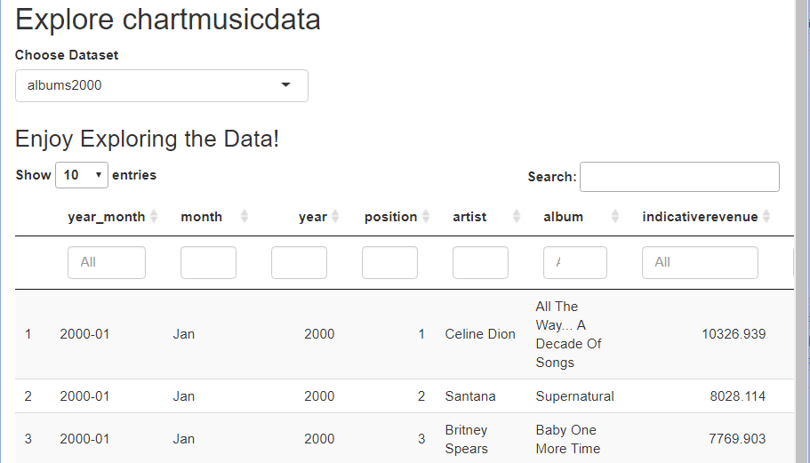

class: agenda

```{r, include=FALSE}
options(htmltools.dir.version = FALSE, htmltools.preserve.raw = FALSE) # seit rmarkdown 2.6
knitr::opts_chunk$set(echo = FALSE, comment = "")
# options(htmltools.dir.version = FALSE)
# library(reticulate) # Damit ein Python-Code-Block möglich ist, trotz eval = FALSE!
library(fontawesome)
library(knitr)
library(tidyverse)
library(chartmusicdata)
```

# Agenda

### .blue[*1. Erste Apps, Grundideen*]
### 2. Simple Reaktivität: Buttons und Auswahlfelder
### 3. Downloads anbieten
### 4. Uploads ermöglichen
### 5. Dynamische User Interfaces
### 6. Layout-Optionen
### 7. Ergänzungen, Ausblick, Literatur

---

layout: true

# 1. Erste Apps, Grundideen

---

## Berühmte erste Worte: "Hallo Welt"

.pull-left[
```{r, echo = TRUE, eval = FALSE}
# install.packages("shiny")
library(shiny)

ui <- fluidPage(  #<<
  "Hallo, Welt!"
)

server <- function(input, output, session) {
}

shinyApp(ui, server)  #<<
```
]

--

.pull-right[
.large[
Aufbau dieser simplen App:

* ***User Interface***:  
  Was sieht der Nutzer?  
  <br>`fluidPage`: simples Seiten-Layout

* ***Server***:  
  Wie verarbeitet R die Nutzereingaben?  
  *Hier gar nicht ...*

]]


---

## Das chartmusicdata-Paket

.pull-left[
#### https://tsort.info/ "The World's Music Charts"
  + Songs und Alben von 1900 bis 2018
  + Punktesystem gut geeignet für Einträge bis etwa 2012

#### https://chart2000.com/ "Music Charts 2000 - 2021"
  + Punktesystem besser für aktuellere Einträge

#### Einmalig installieren; in jeder R-Session bei Bedarf laden

```{r, eval = FALSE, echo = TRUE}
# install.packages("devtools")
library(devtools)
install_github("fjodor/chartmusicdata")
```

```{r}
library(chartmusicdata)
data("topalbums")
```
                        
 
]

.pull-right[

Datensatz | Quelle: tsort.info
----------|-------
charts | Alle Songs und Alben von tsort.info von 1900 bis 2018
topsongs | Top 5000 Songs
topalbums | Top 3000 Alben

<br><br>

Datensatz | Quelle: chart2000.com
----------|-----------------------
songs2000 | Top 50 Songs jedes Monats von Januar 2000 bis Juni 2021
albums2000 | Top 50 Alben jedes Monats von Januar 2000 bis Juni 2021

]

---

## Simple App mit Server-Funktion: chartmusicExplorer

.left-column[

* interaktive Datenexploration

* Paket DT

* Funktion `datatable()`

* eingebettet in App mit komfortabler Auswahl aus allen Datensätzen des Pakets

]
.right-column[
```{r, out.height = "60%", out.width = "60%"}

```
]

---

## Simple App mit Server-Funktion: UI-Teil

.pull-left[
```{r, echo = TRUE, eval = FALSE}
library(chartmusicdata)
library(DT)
library(shiny)

ui <- fluidPage(

  titlePanel("Explore chartmusicdata"),

    selectInput(inputId = "chooseData",  #<<
          label = "Choose Dataset",
          choices = ls("package:chartmusicdata")
      ),
    
      h3("Enjoy Exploring the Data!"),
      
      DTOutput(outputId = "table")  #<<
)
```

]

.pull-right[
.large[

* `titlePanel()`: Titel (legt HTML-Tag `title` an)

* `selectInput()`: Dropdown-Feld

* `DTOutput`(): legt Bereich ("Container") für interaktive Tabelle an

* `inputId, outputId`: Variablen - siehe *server*-Funktion
]]

---

## Simple App mit Server-Funktion: Server

.pull-left[
```{r, echo = TRUE, eval = FALSE}

server <- function(input, output, session) {
  
  output$table <- renderDT({   #<<
    data <- get(input$chooseData,  #<<
                "package:chartmusicdata")
    DT::datatable(data, filter = "top")
  })
}

shinyApp(ui, server)

```
]

.pull-right[
* Bezug auf Ausgabe-Container: `output$table`
* Bezug auf Nutzerauswahl: `input$chooseData`
* **Reaktivität:** Tabelle wird automatisch aktualisiert, wenn der Nutzer einen anderen Datensatz auswählt;  
Shiny kümmert sich um die Details! 
* Wir müssen lediglich eine `render()`-Funktion einsetzen, hier: `renderDT()`
* `DT::datatable()` funktioniert auch in "normalen" Markdown-Dokumenten ohne Shiny
* `input, output, session` in Kopfzeile: Shiny-Standard, wird intern verarbeitet
]

---

